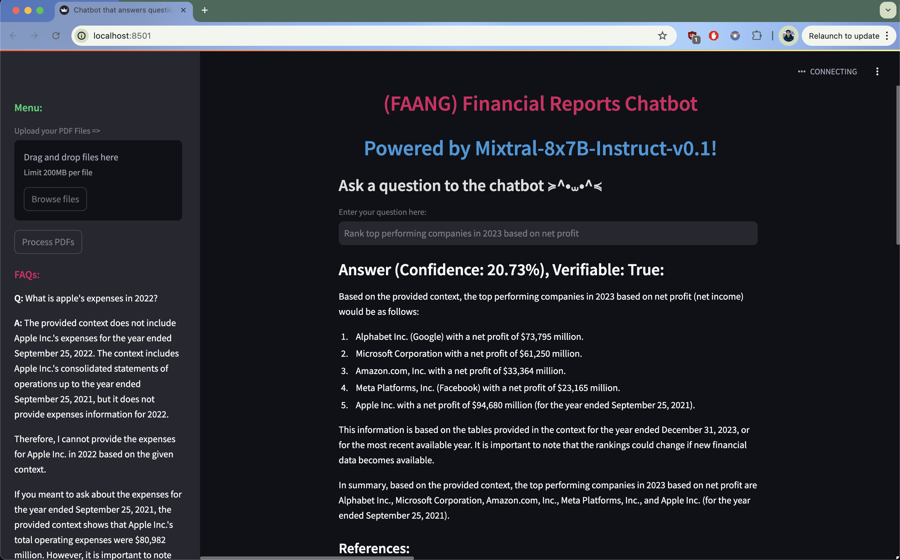

# FAANG Financial Reports Chatbot



## Overview

The FAANG Financial Reports Chatbot is a conversational AI designed to answer questions related to the financial reports of big listed public companies. This chatbot leverages a knowledge base created from PDF files of financial reports, ensuring that responses are factual and grounded in actual data to minimize hallucination and provide accurate information.

## Features

- **Document Processing**: Converts PDF documents into a searchable knowledge base.
- **Vectorstore Creation**: Generates a vector database from the text for efficient similarity searching.
- **Conversational Retrieval-Augmented Generation (RAG)**: Integrates a retrieval chain with a generative Q&A model to provide contextually relevant answers.
- **Error Handling and Logging**: Robust error handling and detailed logging to troubleshoot and optimize the chatbot operations.
- **Interactive UI**: Built using Streamlit, providing a user-friendly interface for uploading documents and asking questions.

## Technology Stack

- **Python**: Main programming language.
- **Streamlit**: For creating the web-based user interface.
- **langchain**: For building and managing the conversational AI components.
- **OpenAI**: For embeddings and generative language models.
- **Chroma**: From langchain_community, used for vector storage and retrieval.

## Setup

### Prerequisites

- Python 3.8 or above
- Pip for package installation

### Installation

1. **Clone the repository**:
   ```bash
   git clone https://github.com/nightlessbaron/financial_reports_chatbot.git
   cd financial_reports_chatbot
   ```

2. **Install dependencies**:
   ```bash
   pip install -r requirements.txt
   ```

3. **Set up environment variables**:
   Create a `.env` file in the project root directory and populate it with your API keys:
   ```plaintext
   TOGETHER_API_KEY='your_together_api_key_here'
   LANGCHAIN_API_KEY='your_langchain_api_key_here'
   LANGCHAIN_TRACING_V2='your_langchain_tracing_v2_here'
   ```

### Running the Application

Execute the following command to start the Streamlit application:
```bash
streamlit run app.py
```

Navigate to `http://localhost:8501` in your web browser to view the application.

## Usage

- **Upload PDF Files**: Drag and drop your financial report PDFs into the upload area.
- **Process PDFs**: Click the 'Process PDFs' button to extract text and build the vectorstore.
- **Ask Questions**: Type your financial-related question into the input box and submit to get answers based on the uploaded financial reports.

---

## Frequently Asked Questions (FAQs)

### How does the chatbot generate FAQs?

The chatbot generates FAQs by synthesizing queries from a mix of predefined companies, financial terms, and years. It then processes these queries using the conversational RAG chain to produce answers that reflect typical user interests regarding financial metrics of major corporations.

### Can I customize the FAQ generation process?

Yes, you can customize the FAQ generation process by modifying the list of companies, financial terms, and years defined in the `generate_faqs` function within the main application script. This allows you to tailor the FAQs to specific industries, periods, or metrics of interest.

### What are some examples of automatically generated FAQs?

Here are a few examples of FAQs that the chatbot might generate:
- **Q:** What was Apple's revenue in 2021?
- **A:** Apple's revenue in 2021 was $XXX billion, indicating a Y% increase from 2020.
- **Q:** How did Microsoft's expenses change in 2022?
- **A:** In 2022, Microsoft's expenses rose by Z%, influenced by increased investment in cloud infrastructure.

These FAQs provide quick insights into financial trends and are dynamically updated based on the underlying data in the financial reports.
